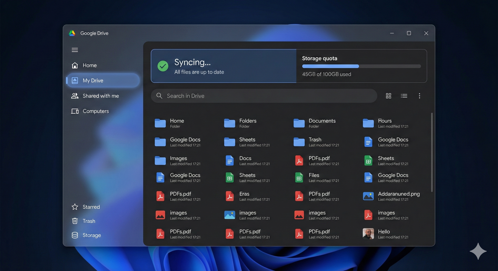

# 🌌 Horizon Drive (Linux Edition)

[](https://opensource.org/licenses/MIT)
[](https://www.linux.org/)
[](https://www.python.org/)

**Horizon Drive** is a premium, native Google Drive desktop client for Linux (optimized for LMDE 7). Designed for power users transitioning from Windows, it brings the "Fluent Design" aesthetic and bulletproof syncing to the Linux desktop.



## ✨ Features

- **Windows 11 Parity**: Indistinguishable from the official Windows client, featuring glassmorphism, rounded corners, and smooth micro-animations.
- **BYOK (Bring Your Own Key)**: Enhanced privacy and speed by using your own Google Cloud API credentials. No shared client bottlenecks.
- **Two-Way Sync**: Reliable background engine powered by `watchdog` for real-time file monitoring.
- **Secure by Design**: Credentials and tokens are stored exclusively in the Linux `keyring`. No plain-text secrets.
- **System Tray Integration**: Native integration for quick status checks and manual sync control.

## 🚀 Getting Started

### Prerequisites

- Python 3.12 or higher
- `pip` (Python package manager)
- A Google Cloud Project (for API keys)

### Installation

1. **Clone the repository**:
   ```bash
   git clone https://github.com/HorizonHubMedia/Horizon-Drive.git
   cd Horizon-Drive
   ```

2. **Install dependencies**:
   ```bash
   pip install -r requirements.txt
   ```

3. **Launch the application**:
   ```bash
   python3 src/main.py
   ```

## 🛠 Setup (BYOK Flow)

To protect your privacy and ensure maximum performance, Horizon Drive requires your own Google API keys:

1. Go to the [Google Cloud Console](https://console.cloud.google.com/).
2. Create a new project named "Horizon Drive".
3. Enable the **Google Drive API**.
4. Configure the **OAuth Consent Screen** (External).
5. Create **OAuth 2.0 Client IDs** (Application type: Desktop App).
6. Copy your **Client ID** and **Client Secret** into the Horizon Drive Welcome Wizard.

## 🏛 Core Philosophy

1. **Credibility First**: Clean, modular code structured for public audits.
2. **User Sovereignty**: You own your data. We facilitate, we do not control.
3. **Visual Excellence**: No default widgets. Every pixel is styled to feel premium.

## 📜 License

Distributed under the MIT License. See `LICENSE` for more information.

---
Built with ❤️ by **Horizon Hub Media**. Let's make Linux beautiful.
